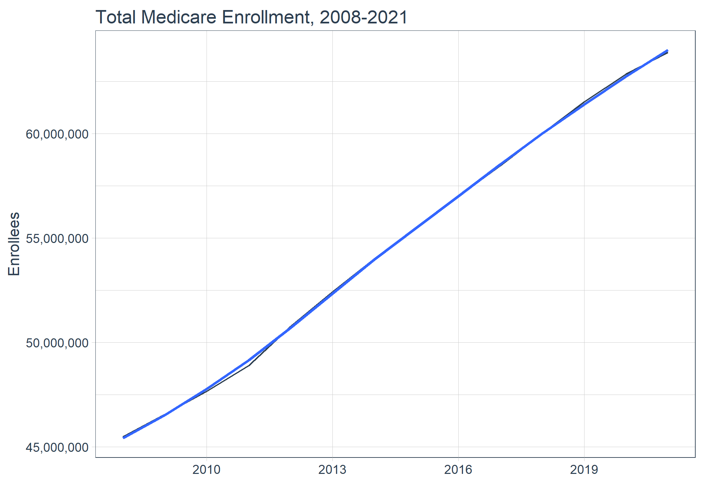
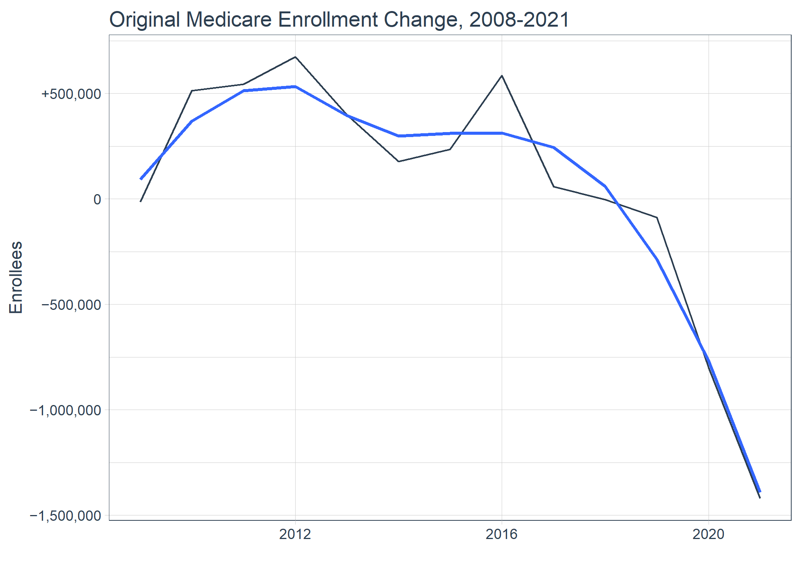
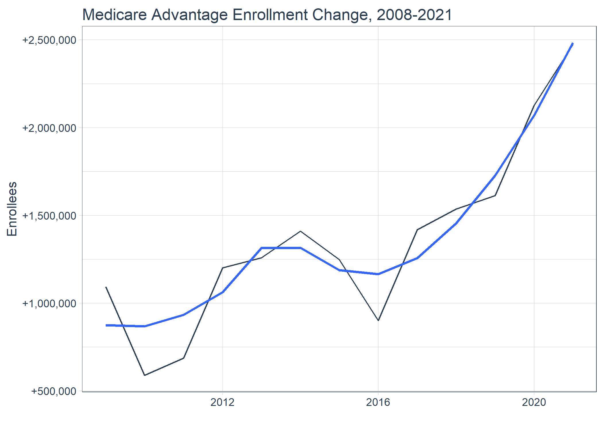

<!-- README.md is generated from README.Rmd. Please edit that file -->

# `{medicare_statistics}`

<!-- badges: start -->
<!-- badges: end -->

## Medicare Enrollment

Total Medicare Enrollment, 2008-2021

``` r
mdcr_enroll_ab_1 <- googlesheets4::read_sheet(
  ss = medicare_enrollment, 
  sheet = "mdcr_enroll_ab_1")

mdcr_enroll_ab_1 <- mdcr_enroll_ab_1 |> 
  dplyr::select(year,
                total = enroll_tot,
                original = enroll_orig,
                ma_other = enroll_ma_oth) |> 
  change_abs(total, year) |> 
  change_abs(original, year) |> 
  change_abs(ma_other, year) |> 
  change_pct(total, total_chg, year) |> 
  change_pct(original, original_chg, year) |> 
  change_pct(ma_other, ma_other_chg, year) |> 
  dplyr::mutate(original_pct = original / total, .after = original) |> 
  dplyr::mutate(ma_other_pct = ma_other / total, .after = ma_other)
```

<br>

``` r
mdcr_enroll_ab_1 |> dplyr::select(year, total, original, ma_other) |> 
  plot_time_series(year, 
                   total,
                   .interactive = F,  
                   .title = "Total Medicare Enrollment, 2008-2021",
                   .y_lab = "Enrollees",
                   .color_lab = "Month") +
  scale_y_continuous(labels = scales::comma_format())
```

 <br>

``` r
mdcr_enroll_ab_1 |> 
  dplyr::select(year, dplyr::ends_with("chg") & !c(dplyr::contains("pct"))) |> 
  dplyr::filter(year != 2008) |> 
  plot_time_series(year, 
                   original_chg, 
                   #.color_var = month(date, label = TRUE),
                   .interactive = FALSE,  
                   .title = "Original Medicare Enrollment Change, 2008-2021",
                   .y_lab = "Enrollees",
                   .color_lab = "Month") +
  scale_y_continuous(labels = scales::label_number(style_positive = "plus", 
                                                   style_negative = "minus", 
                                                   #suffix = "K",
                                                   #scale = 1 / 1e5, 
                                                   big.mark = ","))
```



<br>

``` r
mdcr_enroll_ab_1 |> 
  dplyr::select(year, dplyr::ends_with("chg") & !c(dplyr::contains("pct"))) |> 
  dplyr::filter(year != 2008) |> 
  plot_time_series(year, 
                   ma_other_chg, 
                   #.color_var = month(date, label = TRUE),
                   .interactive = FALSE,  
                   .title = "Medicare Advantage Enrollment Change, 2008-2021",
                   .y_lab = "Enrollees",
                   .color_lab = "Month") +
  scale_y_continuous(labels = scales::label_number(style_positive = "plus", 
                                                   style_negative = "minus", 
                                                   #suffix = "K",
                                                   #scale = 1 / 1e5, 
                                                   big.mark = ","))
```



``` r
mdcr_enroll_ab_1 |> dplyr::select(year, dplyr::contains("pct_chg"))
```

    #> # A tibble: 14 × 4
    #>     year total_pct_chg original_pct_chg ma_other_pct_chg
    #>    <dbl>         <dbl>            <dbl>            <dbl>
    #>  1  2008       NA            NA                  NA     
    #>  2  2009        0.0237       -0.000382            0.109 
    #>  3  2010        0.0237        0.0145              0.0532
    #>  4  2011        0.0258        0.0151              0.0588
    #>  5  2012        0.0384        0.0184              0.0973
    #>  6  2013        0.0326        0.0107              0.0928
    #>  7  2014        0.0303        0.00471             0.0952
    #>  8  2015        0.0275        0.00622             0.0769
    #>  9  2016        0.0268        0.0154              0.0515
    #> 10  2017        0.0259        0.00149             0.0772
    #> 11  2018        0.0262       -0.0000711           0.0776
    #> 12  2019        0.0254       -0.00228             0.0756
    #> 13  2020        0.0216       -0.0208              0.0927
    #> 14  2021        0.0167       -0.0376              0.0986

Total (Original, and Medicare Advantage and Other Health Plan
Enrollment) and Resident Population by Area of Residence, 2013-2021

``` r
mdcr_enroll_ab_2 <- googlesheets4::read_sheet(
  ss = medicare_enrollment, 
  sheet = "mdcr_enroll_ab_2")

mdcr_enroll_ab_2
```

    #> # A tibble: 468 × 12
    #>     year area_of_residence    population enroll_tot enroll_pct_pop enroll_orig
    #>    <dbl> <chr>                     <dbl>      <dbl>          <dbl>       <dbl>
    #>  1  2013 United States         316234505   51280170           16.2    36989054
    #>  2  2013 Alabama                 4827660     921477           19.1      711448
    #>  3  2013 Alaska                   736760      76224           10.4       75676
    #>  4  2013 Arizona                 6616124    1050128           15.9      658948
    #>  5  2013 Arkansas                2956780     572713           19.4      467399
    #>  6  2013 California             38347383    5300177           13.8     3318396
    #>  7  2013 Colorado                5262556     721035           13.7      468492
    #>  8  2013 Connecticut             3602470     608512           16.9      467291
    #>  9  2013 Delaware                 925114     167686           18.1      155803
    #> 10  2013 District of Columbia     650114      83964           12.9       74946
    #> # ℹ 458 more rows
    #> # ℹ 6 more variables: enroll_orig_pct_tot <dbl>, enroll_ma_oth <dbl>,
    #> #   enroll_ma_oth_pct_tot <dbl>, enroll_metro <dbl>, enroll_micro <dbl>,
    #> #   enroll_non_cbsa <dbl>

``` r
mdcr_enroll_ab_2 |> 
  dplyr::select(year,
                area_of_residence, 
                population,
                total = enroll_tot,
                original = enroll_orig,
                ma_other = enroll_ma_oth,
                metropolitan = enroll_metro,
                micropolitan = enroll_micro,
                non_cbsa = enroll_non_cbsa)
```

    #> # A tibble: 468 × 9
    #>     year area_of_residence    population    total original ma_other metropolitan
    #>    <dbl> <chr>                     <dbl>    <dbl>    <dbl>    <dbl>        <dbl>
    #>  1  2013 United States         316234505 51280170 36989054 14291116     41773374
    #>  2  2013 Alabama                 4827660   921477   711448   210029       666054
    #>  3  2013 Alaska                   736760    76224    75676      549        48894
    #>  4  2013 Arizona                 6616124  1050128   658948   391180       987503
    #>  5  2013 Arkansas                2956780   572713   467399   105315       309384
    #>  6  2013 California             38347383  5300177  3318396  1981781      5115305
    #>  7  2013 Colorado                5262556   721035   468492   252542       605972
    #>  8  2013 Connecticut             3602470   608512   467291   141221       571699
    #>  9  2013 Delaware                 925114   167686   155803    11883       167685
    #> 10  2013 District of Columbia     650114    83964    74946     9018        83963
    #> # ℹ 458 more rows
    #> # ℹ 2 more variables: micropolitan <dbl>, non_cbsa <dbl>

Part A and/or Part B Total, Aged, and Disabled Enrollees, 2008-2021

``` r
mdcr_enroll_ab_3 <- googlesheets4::read_sheet(
  ss = medicare_enrollment, 
  sheet = "mdcr_enroll_ab_3")

mdcr_enroll_ab_3 |> 
  janitor::clean_names()
```

    #> # A tibble: 14 × 13
    #>     year a_and_or_b_tot a_and_or_b_aged a_and_or_b_dsb a_and_b_tot a_and_b_aged
    #>    <dbl>          <dbl>           <dbl>          <dbl>       <dbl>        <dbl>
    #>  1  2008       45481401        38023429        7457972    41644298     35125146
    #>  2  2009       46560598        38890149        7670449    42575812     35825873
    #>  3  2010       47663396        39733647        7929748    43540911     36510370
    #>  4  2011       48892758        40685908        8206850    44584604     37277355
    #>  5  2012       50768714        42312831        8455883    46152980     38597531
    #>  6  2013       52425659        43761388        8664271    47620905     39837291
    #>  7  2014       54013038        45216665        8796373    49073941     41136982
    #>  8  2015       55496222        46630952        8865269    50414746     42398568
    #>  9  2016       56981183        48143217        8837966    51743591     43732621
    #> 10  2017       58457244        49678033        8779211    53008234     45053353
    #> 11  2018       59989883        51303898        8685985    54349822     46473318
    #> 12  2019       61514510        52991455        8523055    55653848     47922107
    #> 13  2020       62840267        54531919        8308348    56966865     49391345
    #> 14  2021       63892626        55851321        8041304    58041288     50689108
    #> # ℹ 7 more variables: a_and_b_dsb <dbl>, a_tot <dbl>, a_aged <dbl>,
    #> #   a_dsb <dbl>, b_tot <dbl>, b_aged <dbl>, b_dsb <dbl>

Part A and/or Part B Enrollees by Age Group, 2008-2021

``` r
mdcr_enroll_ab_4 <- googlesheets4::read_sheet(
  ss = medicare_enrollment, 
  sheet = "mdcr_enroll_ab_4")

mdcr_enroll_ab_4
```

    #> # A tibble: 14 × 22
    #>     year    total tot_lt_18 pct_lt_18 tot_18_24 pct_18_24 tot_25_34 pct_25_34
    #>    <dbl>    <dbl>     <dbl>     <dbl>     <dbl>     <dbl>     <dbl>     <dbl>
    #>  1  2008 45481401      2205         0    101799      0.22    540763      1.19
    #>  2  2009 46560598      2127         0    104503      0.22    556016      1.19
    #>  3  2010 47663396      2074         0    109672      0.23    579725      1.22
    #>  4  2011 48892758      2071         0    117321      0.24    610856      1.25
    #>  5  2012 50768714      1995         0    120270      0.24    633062      1.25
    #>  6  2013 52425659      1941         0    119237      0.23    643565      1.23
    #>  7  2014 54013038      1844         0    114851      0.21    642113      1.19
    #>  8  2015 55496222      1716         0    108143      0.19    633073      1.14
    #>  9  2016 56981183      1596         0    101144      0.18    616311      1.08
    #> 10  2017 58457244      1550         0     96951      0.17    600268      1.03
    #> 11  2018 59989883      1510         0     94201      0.16    585756      0.98
    #> 12  2019 61514510      1471         0     93039      0.15    568856      0.92
    #> 13  2020 62840267      1389         0     91847      0.15    550106      0.88
    #> 14  2021 63892626      1349         0     90251      0.14    534665      0.84
    #> # ℹ 14 more variables: tot_35_44 <dbl>, pct_35_44 <dbl>, tot_45_54 <dbl>,
    #> #   pct_45_54 <dbl>, tot_55_64 <dbl>, pct_55_64 <dbl>, tot_65_74 <dbl>,
    #> #   pct_65_74 <dbl>, tot_75_84 <dbl>, pct_75_84 <dbl>, tot_85_94 <dbl>,
    #> #   pct_85_94 <dbl>, tot_95_gt <dbl>, pct_95_gt <dbl>

``` r
mdcr_enroll_ab_4 |> 
  dplyr::select(year, total, dplyr::contains("tot_")) |> 
  dplyr::mutate(pct_lt_18 = janitor::round_half_up(tot_lt_18 / total, digits = 10), .after = tot_lt_18) |> 
  dplyr::mutate(pct_18_24 = janitor::round_half_up(tot_18_24 / total, digits = 5), .after = tot_18_24) |> 
  dplyr::mutate(pct_25_34 = janitor::round_half_up(tot_25_34 / total, digits = 5), .after = tot_25_34) |> 
  dplyr::mutate(pct_35_44 = janitor::round_half_up(tot_35_44 / total, digits = 5), .after = tot_35_44) |> 
  dplyr::mutate(pct_45_54 = janitor::round_half_up(tot_45_54 / total, digits = 5), .after = tot_45_54) |> 
  dplyr::mutate(pct_55_64 = janitor::round_half_up(tot_55_64 / total, digits = 5), .after = tot_55_64) |> 
  dplyr::mutate(pct_65_74 = janitor::round_half_up(tot_65_74 / total, digits = 5), .after = tot_65_74) |> 
  dplyr::mutate(pct_75_84 = janitor::round_half_up(tot_75_84 / total, digits = 5), .after = tot_75_84) |> 
  dplyr::mutate(pct_85_94 = janitor::round_half_up(tot_85_94 / total, digits = 5), .after = tot_85_94) |> 
  dplyr::mutate(pct_95_gt = janitor::round_half_up(tot_95_gt / total, digits = 5), .after = tot_95_gt) |> 
  dplyr::select(year, dplyr::contains("pct_"))
```

    #> # A tibble: 14 × 11
    #>     year pct_lt_18 pct_18_24 pct_25_34 pct_35_44 pct_45_54 pct_55_64 pct_65_74
    #>    <dbl>     <dbl>     <dbl>     <dbl>     <dbl>     <dbl>     <dbl>     <dbl>
    #>  1  2008 0.0000485   0.00224   0.0119     0.0253    0.0514    0.0731     0.426
    #>  2  2009 0.0000457   0.00224   0.0119     0.0243    0.0514    0.0749     0.430
    #>  3  2010 0.0000435   0.0023    0.0122     0.0237    0.0511    0.0771     0.433
    #>  4  2011 0.0000424   0.0024    0.0125     0.0234    0.0506    0.0789     0.438
    #>  5  2012 0.0000393   0.00237   0.0125     0.0230    0.0492    0.0795     0.449
    #>  6  2013 0.0000370   0.00227   0.0123     0.0224    0.0477    0.0805     0.457
    #>  7  2014 0.0000341   0.00213   0.0119     0.0218    0.0458    0.0813     0.465
    #>  8  2015 0.0000309   0.00195   0.0114     0.0209    0.0437    0.0818     0.472
    #>  9  2016 0.0000280   0.00178   0.0108     0.0199    0.0412    0.0814     0.478
    #> 10  2017 0.0000265   0.00166   0.0103     0.0192    0.0386    0.0804     0.481
    #> 11  2018 0.0000252   0.00157   0.00976    0.0186    0.0360    0.0788     0.484
    #> 12  2019 0.0000239   0.00151   0.00925    0.0178    0.0334    0.0766     0.490
    #> 13  2020 0.0000221   0.00146   0.00875    0.0172    0.0311    0.0737     0.497
    #> 14  2021 0.0000211   0.00141   0.00837    0.0166    0.0293    0.0702     0.498
    #> # ℹ 3 more variables: pct_75_84 <dbl>, pct_85_94 <dbl>, pct_95_gt <dbl>

Part A and/or Part B Enrollees by Demographics, 2013-2021

``` r
mdcr_enroll_ab_5 <- googlesheets4::read_sheet(
  ss = medicare_enrollment, 
  sheet = "mdcr_enroll_ab_5")

mdcr_enroll_ab_5 |> 
  janitor::clean_names()
```

    #> # A tibble: 198 × 7
    #>     year group        subgroup    a_and_or_b  a_and_b        a        b
    #>    <dbl> <chr>        <chr>            <dbl>    <dbl>    <dbl>    <dbl>
    #>  1  2013 Total        Total         52425659 47620905 52087121 47959444
    #>  2  2013 Age Simple   Under 65       8664271  7783614  8663703  7784182
    #>  3  2013 Age Simple   65 and Over   43761388 39837291 43423417 40175262
    #>  4  2013 Age Detailed Under 18          1941     1678     1938     1681
    #>  5  2013 Age Detailed 18-24           119237   108978   119208   109007
    #>  6  2013 Age Detailed 25-34           643565   582855   643491   582929
    #>  7  2013 Age Detailed 35-44          1176676  1051211  1176567  1051320
    #>  8  2013 Age Detailed 45-54          2502144  2239751  2502012  2239884
    #>  9  2013 Age Detailed 55-64          4220708  3799142  4220488  3799362
    #> 10  2013 Age Detailed 65-74         23947186 20867802 23785639 21029349
    #> # ℹ 188 more rows

Part A and/or Part B Enrollees by Type of Entitlement and Demographics,
2013-2021

``` r
mdcr_enroll_ab_6 <- googlesheets4::read_sheet(
  ss = medicare_enrollment, 
  sheet = "mdcr_enroll_ab_6")

mdcr_enroll_ab_6
```

    #> # A tibble: 198 × 10
    #>     year group  subgroup  total   aged aged_no_esrd aged_esrd    dsb dsb_no_esrd
    #>    <dbl> <chr>  <chr>     <dbl>  <dbl>        <dbl>     <dbl>  <dbl>       <dbl>
    #>  1  2013 Total  Total    5.24e7 4.38e7     43526798    234590 8.66e6     8421102
    #>  2  2013 Age S… Under 65 8.66e6 0                 0         0 8.66e6     8421102
    #>  3  2013 Age S… 65 and … 4.38e7 4.38e7     43526798    234590 0                0
    #>  4  2013 Age D… Under 18 1.94e3 0                 0         0 1.94e3          14
    #>  5  2013 Age D… 18-24    1.19e5 0                 0         0 1.19e5      115495
    #>  6  2013 Age D… 25-34    6.44e5 0                 0         0 6.44e5      627271
    #>  7  2013 Age D… 35-44    1.18e6 0                 0         0 1.18e6     1140185
    #>  8  2013 Age D… 45-54    2.50e6 0                 0         0 2.50e6     2430016
    #>  9  2013 Age D… 55-64    4.22e6 0                 0         0 4.22e6     4108122
    #> 10  2013 Age D… 65-74    2.39e7 2.39e7     23820823    126364 0                0
    #> # ℹ 188 more rows
    #> # ℹ 1 more variable: dsb_esrd <dbl>

Part A and/or Part B Total, Aged, and Disabled Enrollees by Area of
Residence, 2013-2021

``` r
mdcr_enroll_ab_7 <- googlesheets4::read_sheet(
  ss = medicare_enrollment, 
  sheet = "mdcr_enroll_ab_7")

mdcr_enroll_ab_7 |> 
  janitor::clean_names()
```

    #> # A tibble: 540 × 15
    #>     year group   area_of_residence a_and_or_b_tot a_and_or_b_aged a_and_or_b_dsb
    #>    <dbl> <chr>   <chr>                      <dbl>           <dbl>          <dbl>
    #>  1  2013 All     All Areas               52425659        43761388        8664271
    #>  2  2013 Nation… United States           51280170        42814275        8465894
    #>  3  2013 State   Alabama                   921477          698720         222758
    #>  4  2013 State   Alaska                     76224           63712          12512
    #>  5  2013 State   Arizona                  1050128          898705         151422
    #>  6  2013 State   Arkansas                  572713          438855         133859
    #>  7  2013 State   California               5300177         4582391         717786
    #>  8  2013 State   Colorado                  721035          620821         100214
    #>  9  2013 State   Connecticut               608512          526964          81548
    #> 10  2013 State   Delaware                  167686          141355          26332
    #> # ℹ 530 more rows
    #> # ℹ 9 more variables: a_and_b_tot <dbl>, a_and_b_aged <dbl>, a_and_b_dsb <dbl>,
    #> #   a_tot <dbl>, a_aged <dbl>, a_dsb <dbl>, b_tot <dbl>, b_aged <dbl>,
    #> #   b_dsb <dbl>

Part A and/or Part B Enrollees, by Type of Entitlement and Area of
Residence, 2013-2021

``` r
mdcr_enroll_ab_8 <- googlesheets4::read_sheet(
  ss = medicare_enrollment, 
  sheet = "mdcr_enroll_ab_8")

mdcr_enroll_ab_8
```

    #> # A tibble: 540 × 10
    #>     year group    area_of_residence   total   aged aged_no_esrd aged_esrd    dsb
    #>    <dbl> <chr>    <chr>               <dbl>  <dbl>        <dbl>     <dbl>  <dbl>
    #>  1  2013 All      All Areas          5.24e7 4.38e7     43526798    234590 8.66e6
    #>  2  2013 National United States      5.13e7 4.28e7     42583092    231183 8.47e6
    #>  3  2013 State    Alabama            9.21e5 6.99e5       694586      4134 2.23e5
    #>  4  2013 State    Alaska             7.62e4 6.37e4        63460       252 1.25e4
    #>  5  2013 State    Arizona            1.05e6 8.99e5       894246      4459 1.51e5
    #>  6  2013 State    Arkansas           5.73e5 4.39e5       436922      1933 1.34e5
    #>  7  2013 State    California         5.30e6 4.58e6      4552799     29592 7.18e5
    #>  8  2013 State    Colorado           7.21e5 6.21e5       618628      2193 1.00e5
    #>  9  2013 State    Connecticut        6.09e5 5.27e5       524647      2318 8.15e4
    #> 10  2013 State    Delaware           1.68e5 1.41e5       140510       845 2.63e4
    #> # ℹ 530 more rows
    #> # ℹ 2 more variables: dsb_no_esrd <dbl>, dsb_esrd <dbl>

## Medicare Deaths

Total Beneficiaries by Month of Death, 2008-2021

``` r
mdcr_enroll_ab_33 <- googlesheets4::read_sheet(
  ss = medicare_deaths, 
  sheet = "mdcr_enroll_ab_33")

mdcr_enroll_ab_33 |> 
  dplyr::mutate(valid_total = january + february + march + april + may + june + july + august + september + october + november + december, 
                .after = total)
```

    #> # A tibble: 14 × 15
    #>     year   total valid_total january february  march  april    may   june   july
    #>    <dbl>   <dbl>       <dbl>   <dbl>    <dbl>  <dbl>  <dbl>  <dbl>  <dbl>  <dbl>
    #>  1  2008 1998215     1998215  183291   182939 191125 167865 162702 151849 152562
    #>  2  2009 1964086     1964086  181710   163257 175808 164383 161042 152235 155085
    #>  3  2010 2003962     2003962  182764   164013 179059 164071 164423 154780 159156
    #>  4  2011 2046334     2046334  192388   174158 184738 169542 168672 159038 161785
    #>  5  2012 2077591     2077591  185736   172293 182112 170154 168824 160540 164364
    #>  6  2013 2126488     2126488  218498   180563 192083 175381 171149 161565 165184
    #>  7  2014 2144287     2144287  199003   174146 187917 177001 177522 166394 170137
    #>  8  2015 2220438     2220438  222132   189056 200318 184375 181780 170834 175098
    #>  9  2016 2226692     2226692  203187   189036 199760 185310 182029 167301 174359
    #> 10  2017 2290129     2290129  217850   193511 207513 189246 180079 175988 178507
    #> 11  2018 2323160     2323160  239498   196331 205047 191537 186155 177694 181381
    #> 12  2019 2337988     2337988  213519   192531 210319 193424 193648 183296 185481
    #> 13  2020 2750553     2750553  218061   200966 220966 263258 224985 198268 221054
    #> 14  2021 2750141     2750141  307319   228941 216513 203532 203719 192791 202717
    #> # ℹ 5 more variables: august <dbl>, september <dbl>, october <dbl>,
    #> #   november <dbl>, december <dbl>

Total Beneficiaries by Demographics, 2013-2021

``` r
mdcr_enroll_ab_34 <- googlesheets4::read_sheet(
  ss = medicare_deaths, 
  sheet = "mdcr_enroll_ab_34")

mdcr_enroll_ab_34
```

    #> # A tibble: 198 × 6
    #>     year group        subgroup      total original ma_other
    #>    <dbl> <chr>        <chr>         <dbl>    <dbl>    <dbl>
    #>  1  2013 Total        Total       2126488  1594827   531661
    #>  2  2013 Age Simple   Under 65     197013   159083    37930
    #>  3  2013 Age Simple   65 and Over 1929475  1435744   493731
    #>  4  2013 Age Detailed Under 18         24       24        0
    #>  5  2013 Age Detailed 18-24           690      641       49
    #>  6  2013 Age Detailed 25-34          5052     4541      511
    #>  7  2013 Age Detailed 35-44         14276    12218     2058
    #>  8  2013 Age Detailed 45-54         50225    41606     8619
    #>  9  2013 Age Detailed 55-64        126746   100053    26693
    #> 10  2013 Age Detailed 65-74        454912   334073   120839
    #> # ℹ 188 more rows

Total Beneficiaries by Area of Residence, 2013-2021

``` r
mdcr_enroll_ab_35 <- googlesheets4::read_sheet(
  ss = medicare_deaths, 
  sheet = "mdcr_enroll_ab_35")
```

    #> Error in `read_cells_impl_()`:
    #> ! Client error: (429) RESOURCE_EXHAUSTED
    #> • Either out of resource quota or reaching rate limiting. The client should
    #>   look for google.rpc.QuotaFailure error detail for more information.
    #> • Quota exceeded for quota metric 'Read requests' and limit 'Read requests per
    #>   minute' of service 'sheets.googleapis.com' for consumer
    #>   'project_number:603366585132'.
    #> 
    #> Error details:
    #> • reason: RATE_LIMIT_EXCEEDED
    #> • domain: googleapis.com
    #> • metadata.quota_location: global
    #> • metadata.quota_limit: ReadRequestsPerMinutePerProject
    #> • metadata.consumer: projects/603366585132
    #> • metadata.quota_metric: sheets.googleapis.com/read_requests
    #> • metadata.quota_limit_value: 600
    #> • metadata.service: sheets.googleapis.com
    #> Links
    #> • Description: Request a higher quota limit.
    #>   URL: https://cloud.google.com/docs/quota#requesting_higher_quota

``` r
mdcr_enroll_ab_35
```

    #> Error in eval(expr, envir, enclos): object 'mdcr_enroll_ab_35' not found

Original Medicare Beneficiaries by Month of Death, 2008-2021

``` r
mdcr_enroll_ab_36 <- googlesheets4::read_sheet(
  ss = medicare_deaths, 
  sheet = "mdcr_enroll_ab_36")

mdcr_enroll_ab_36 |> 
  dplyr::mutate(valid_total = january + february + march + april + may + june + july + august + september + october + november + december, 
                .after = total)
```

    #> # A tibble: 14 × 15
    #>     year   total valid_total january february  march  april    may   june   july
    #>    <dbl>   <dbl>       <dbl>   <dbl>    <dbl>  <dbl>  <dbl>  <dbl>  <dbl>  <dbl>
    #>  1  2008 1608390     1608390  149153   148843 154669 135501 130860 121760 122395
    #>  2  2009 1551174     1551174  144681   129735 139291 130087 127332 119894 121961
    #>  3  2010 1572541     1572541  144927   129475 141088 128941 128981 121156 124335
    #>  4  2011 1592521     1592521  151447   136389 143900 132162 131426 123803 125598
    #>  5  2012 1587458     1587458  142922   132529 139751 130087 129114 122523 125528
    #>  6  2013 1594827     1594827  165747   136042 144585 132039 128569 120968 123330
    #>  7  2014 1569391     1569391  147485   128212 138330 130314 130209 121794 124164
    #>  8  2015 1586316     1586316  160662   136278 143563 131778 130070 122183 124678
    #>  9  2016 1566644     1566644  143510   133316 141272 131023 128467 117858 122604
    #> 10  2017 1564039     1564039  150051   133091 143072 129356 123143 120022 121775
    #> 11  2018 1538103     1538103  160276   130948 136001 127001 123296 117546 119882
    #> 12  2019 1505119     1505119  138504   124881 136599 125485 124738 117859 119205
    #> 13  2020 1695277     1695277  136332   125685 137622 163352 140041 122574 134677
    #> 14  2021 1585841     1585841  180346   133282 126006 117899 117916 111634 117390
    #> # ℹ 5 more variables: august <dbl>, september <dbl>, october <dbl>,
    #> #   november <dbl>, december <dbl>

Original Medicare Beneficiaries by Area of Residence, 2013-2021

``` r
mdcr_enroll_ab_37 <- googlesheets4::read_sheet(
  ss = medicare_deaths, 
  sheet = "mdcr_enroll_ab_37")

mdcr_enroll_ab_37
```

    #> # A tibble: 513 × 6
    #>     year group    area_of_residence   total    aged disabled
    #>    <dbl> <chr>    <chr>               <dbl>   <dbl>    <dbl>
    #>  1  2013 All      All Areas         1594827 1435744   159083
    #>  2  2013 National United States     1572213 1414382   157831
    #>  3  2013 State    Alabama             31955   27991     3964
    #>  4  2013 State    Alaska               2569       0        0
    #>  5  2013 State    Arizona             23823   21787     2036
    #>  6  2013 State    Arkansas            21078   18577     2501
    #>  7  2013 State    California         125596  113681    11915
    #>  8  2013 State    Colorado            16965   15307     1658
    #>  9  2013 State    Connecticut         20369   18919     1450
    #> 10  2013 State    Delaware             5827    5212      615
    #> # ℹ 503 more rows

Medicare Advantage and Other Health Plan Beneficiaries by Month of
Death, 2008-2021

``` r
mdcr_enroll_ab_38 <- googlesheets4::read_sheet(
  ss = medicare_deaths, 
  sheet = "mdcr_enroll_ab_38")

mdcr_enroll_ab_38 |> 
  dplyr::mutate(valid_total = january + february + march + april + may + june + july + august + september + october + november + december, 
                .after = total)
```

    #> # A tibble: 14 × 15
    #>     year   total valid_total january february march april   may  june  july
    #>    <dbl>   <dbl>       <dbl>   <dbl>    <dbl> <dbl> <dbl> <dbl> <dbl> <dbl>
    #>  1  2008  389825      389825   34138    34096 36456 32364 31842 30089 30167
    #>  2  2009  412912      412912   37029    33522 36517 34296 33710 32341 33124
    #>  3  2010  431421      431421   37837    34538 37971 35130 35442 33624 34821
    #>  4  2011  453813      453813   40941    37769 40838 37380 37246 35235 36187
    #>  5  2012  490133      490133   42814    39764 42361 40067 39710 38017 38836
    #>  6  2013  531661      531661   52751    44521 47498 43342 42580 40597 41854
    #>  7  2014  574896      574896   51518    45934 49587 46687 47313 44600 45973
    #>  8  2015  634122      634122   61470    52778 56755 52597 51710 48651 50420
    #>  9  2016  660048      660048   59677    55720 58488 54287 53562 49443 51755
    #> 10  2017  726090      726090   67799    60420 64441 59890 56936 55966 56732
    #> 11  2018  785057      785057   79222    65383 69046 64536 62859 60148 61499
    #> 12  2019  832869      832869   75015    67650 73720 67939 68910 65437 66276
    #> 13  2020 1055276     1055276   81729    75281 83344 99906 84944 75694 86377
    #> 14  2021 1164300     1164300  126973    95659 90507 85633 85803 81157 85327
    #> # ℹ 5 more variables: august <dbl>, september <dbl>, october <dbl>,
    #> #   november <dbl>, december <dbl>

Medicare Advantage and Other Health Plan Beneficiaries by Area of
Residence, 2013-2021

``` r
mdcr_enroll_ab_39 <- googlesheets4::read_sheet(
  ss = medicare_deaths, 
  sheet = "mdcr_enroll_ab_39")

mdcr_enroll_ab_39
```

    #> # A tibble: 513 × 6
    #>     year group    area_of_residence  total   aged disabled
    #>    <dbl> <chr>    <chr>              <dbl>  <dbl>    <dbl>
    #>  1  2013 All      All Areas         531661 493731    37930
    #>  2  2013 National United States     515518 478970    36548
    #>  3  2013 State    Alabama             7800   6495     1305
    #>  4  2013 State    Alaska                30      0        0
    #>  5  2013 State    Arizona            15537  14064     1473
    #>  6  2013 State    Arkansas            3561   2947      614
    #>  7  2013 State    California         71950  68794     3156
    #>  8  2013 State    Colorado            9133   8597      536
    #>  9  2013 State    Connecticut         4491   4273      218
    #> 10  2013 State    Delaware             485    446       39
    #> # ℹ 503 more rows
